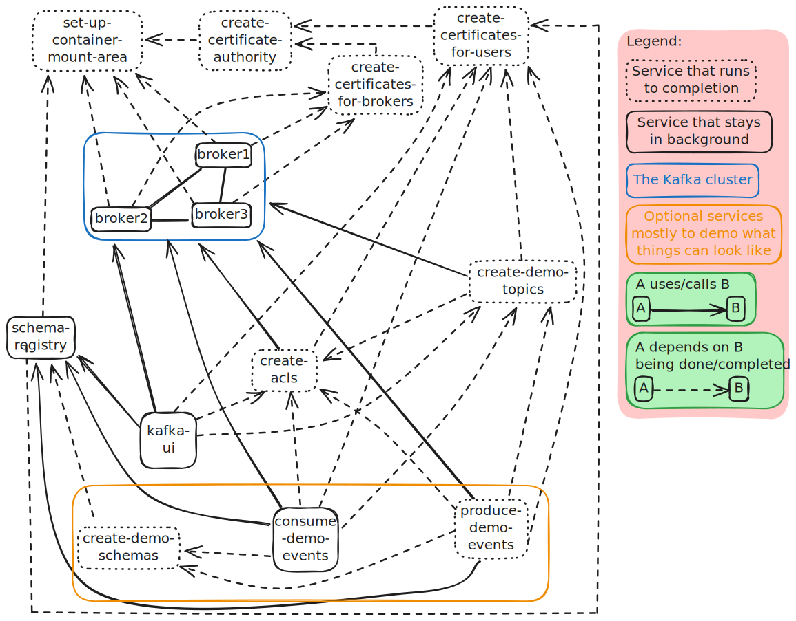

This is a demo setup of a 3 broker cluster, with auth and mTls, both for communication between clients and brokers, but also between brokers.
We do not recommend running this as is in your production environment.
But, should you set up ACLs and mTLS in prod, this can hopefully help you set up such a system locally, so you can debug various issues, and try out more production ready configurations locally.

# Network Illustration

# Components, life cycles, and dependencies

